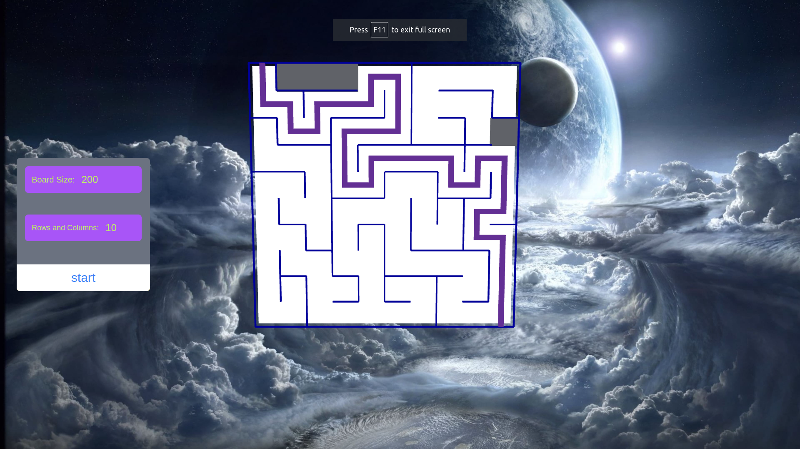
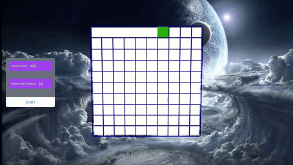

<h1 align="center"><a href="https://maze.theo-moore-calters.online">astar-algorithm-maze</a></h1>

  

## ➤ Table of Contents

* [➤ ::pencil:: About The Project](#-pencil-about-the-project)
* [➤ :rocket: Dependencies](#-rocket-dependencies)
* [➤ :floppy_disk: Key Project File Description](#-floppy_disk-key-project-file-description)
* [➤ :coffee: Buy me a coffee](#-coffee-buy-me-a-coffee)
* [➤ :scroll: Credits](#-scroll-credits)
* [➤ License](#-license)

## ➤ ::pencil:: About The Project

[This project](https://maze.theo-moore-calters.online) showcases the power of the [A* search algorithm](https://en.wikipedia.org/wiki/A*_search_algorithm) through interactive maze solving and generation. Built using TypeScript, Three.js and React, it offers a visually engaging demonstration of pathfinding in action. Users can explore the process of maze generation and watch as the A* algorithm efficiently navigates these intricate labyrinths. This project provides both an educational experience and an intriguing glimpse into the world of algorithmic problem-solving.
[maze.theo-moore-calters.online](https://maze.theo-moore-calters.online)

  

## ➤ :rocket: Dependencies

The A* search algorithm is implemented in TypeScript to handle the logic behind maze solving. For the visual representation of maze generation and solving, this project leverages the Three.js library. To provide a user-friendly interface and deploy the application as a web-based tool, it's encapsulated within a React application.
  
 
   
  

## ➤ :floppy_disk: Key Project File Description

*  The `main.ts` file is the entry point for the A* search algorithm maze demonstration, responsible for initializing the scene, camera, and controls, managing the animation loop, and handling user interactions.
* The `maze.ts` file encapsulates the core logic for generating and managing the maze within the demonstration. It includes methods for setting up the maze grid, creating it, and managing its state.
* The `mazeCell.ts` class represents the logic for individual cells in the maze. It contains various properties and methods to manage the state and appearance of each cell.
* The `AStarMazeSolver` class is responsible for implementing the A* algorithm to solve a maze.

## ➤ :coffee: Buy me a coffee
Whether you use this project, have learned something from it, or just like it, please consider supporting it by buying me a coffee, so I can dedicate more time on open-source projects like this (҂⌣̀_⌣́)

## ➤ :scroll: Credits

Theo Moore-Calters 

 

## ➤ License
	
Licensed under [license](https://opensource.org/licenses/license).
